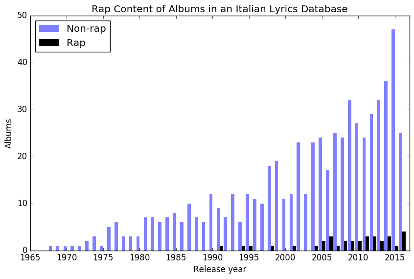
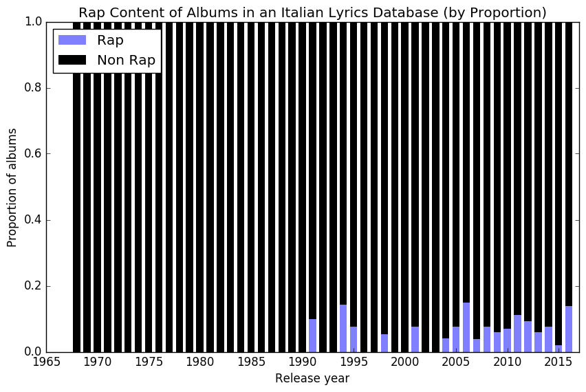
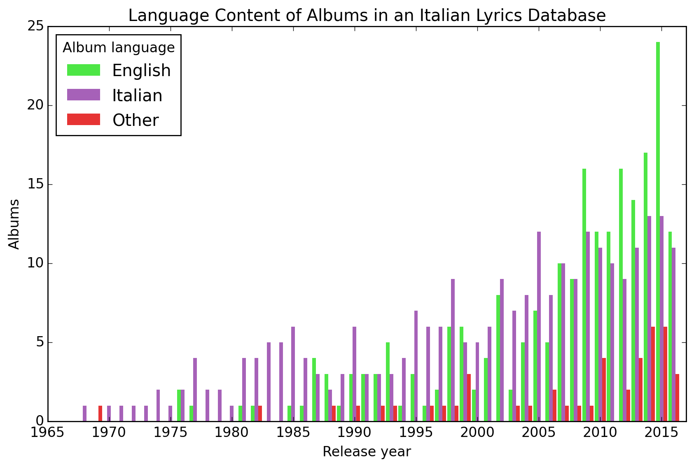
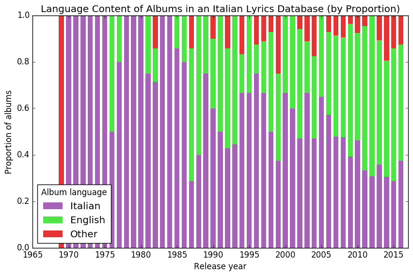

Proposal: RapItalia
-------------------

Living in Italy and observing how hip hop is a relatively new phenomenon here, I got interested in how coolness travels between cultures, with a delay. Something that could turn out to be very profitable. My hypothesis was that Italians began to develop a taste for rap music in about the mid 2000s (about 10 years after it became a powerful force in North American pop culture). 

To evaluate the popularity of rap in Italy over time, I used as a proxy the publication date of songs found on the Italian lyrics website "aztesti.it". Although the process used to select songs is unknown, such websites are designed to optimize traffic, and so they offer a sample of songs regularly searched for by current users. Based on the title and site design, only Italian-speaking users. I wrote a custom web crawler to scrape the lyrics. This process ran into difficulties when, after a certain number of requests, my IP address was banned. I changed strategies, and sampled only the first song from each album of the top 100 artists, and increased the delay between accesses to once every 2 seconds. My IP address was still banned three more times, but I collected one song from 687 albums.

I built a crude genre classifier to judge whether a song was a rap song or not, based on the total number of words, with the cutoff being 500 words. If the first song on an album was a rap song, that album was categorized as a rap album. Then I plotted the number of rap albums per year in the lyric database, along with the number of non-rap songs. 

There was some support for my hypothesis, since most of the rap albums in the database were from the last 10 years. Even when viewed as a proportion, though, there does not seem to be a consistent trend in the proportion of rap albums:

As a secondary investigation, I used a pre-written language classifier (based on stopwords in the NTLK package) on the first songs, to see whether English-language albums were getting more popular with time relative to Italian albums, as another example of americanization of taste. The raw number of albums:

There are more English-language albums from recent years than Italian albums, and the trend is confirmed by the proportions:

English albums become more represented relative to Italian albums as the publication dates come closer to the present, at least with more consistent growth in the last 10 years (which are also less volatile proportions because of the larger samples).

Although a larger and more systematically sampled data set, especially one with genre tags, will give more accurate measures, to track cool - and especially to forecast it - messy, non-traditional data sources need to be exploited. 