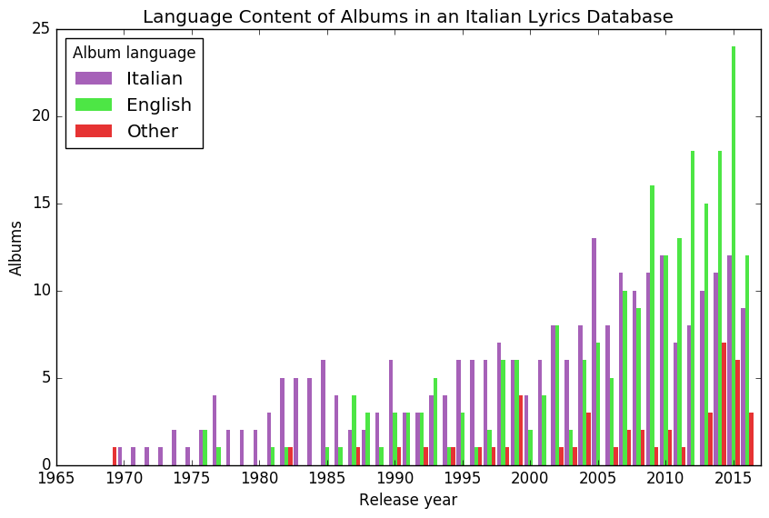

Proposal: RapItalia
-------------------

Living in Italy and observing how hip hop is a relatively new phenomenon here, I got interested in how coolness travels between cultures, with a delay. An understanding of this can be used to make money. My hypothesis was that Italians began to develop a taste for rap music in about the mid 2000s (about 10 years after it became a powerful force in North American pop culture). 

To evaluate the popularity of rap in Italy over time, I used as a proxy the publication date of songs found on the Italian lyrics website "aztesti.it". Although the process used to select songs is unknown, such websites are designed to optimize traffic, and so they offer a sample of songs regularly searched for by users. Based on the title and site design, only Italian-speaking users. I wrote a custom web crawler to scrape the lyrics, which had difficulties since after a certain number of requests my IP address was banned. I changed strategies, and sampled only the first song from each album of the top 100 artists, and increased the delay between accesses to once every 2 seconds. My IP address was still banned three more times, but I collected data on 736 albums, resulting in 668 lyric texts.

I built a crude genre classifier to judge whether a song was a rap song or not, based on the total number of words, with the cutoff being 500 words. If the first song on an album was a rap song, that album was categorized as a rap album. Then I plotted the number of rap albums per year in the lyric database, along with the number of non-rap songs. There was some support for my hypothesis, since most of the rap albums in the database were from the last 5 years. However, if anything, the proportion of rap albums went down over the last ten years.

I also used a premade language classifier on the first songs, to see whether English-language albums were getting more popular with time relative to Italian albums, as another example of americanization of taste. There wasn't clear evidence for this, since there seem to be roughly equal numbers of English and Italian songs at the different years. 

Although a larger data set, especially one with genre tags, will give more accurate measures, to track cool - and especially to forecast it - messy, non-traditional data sources need to be exploited. 